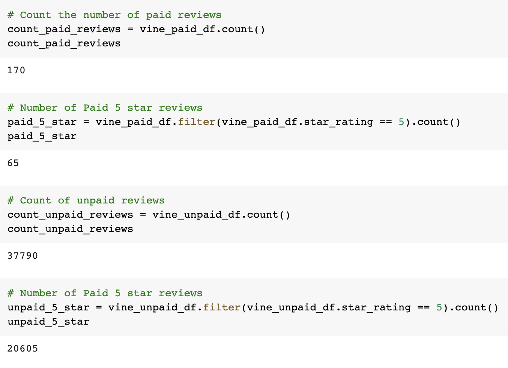
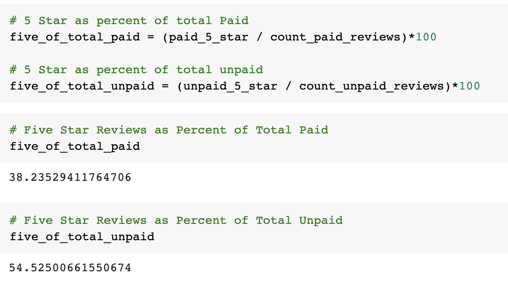

# Amazon_Vine_Analysis
Author: Jerome Simmons

## Overview of the Analysis
In this assignment, we analyzed Pet Product review data using PySpark. We analzyed paid reviews as well as non-paid reviews in order to determine if there was any bias between the two datasets. In order to determine bias, we reviewed the percentage of five star reviews from paid and unpaid review data.

## Results
The paid base was significantly smaller than the unpaid base. Nevertheless, the unpaid reviews tended to be more favorable (more 5-star reviews) than paid reviews.

#### How many Vine reviews & non-Vine reviews were there?
* There were 170 paid ("vine") reviews and 37,790 unpaid ("non-vine") reviews

#### How many Vine reviews were 5 stars? How many non-Vine reviews were 5-stars?
* There were 65 paid 5-star ("vine") reviews and 20,605 unpaid 5-star ("non-vine") reviews.

#### What percentage of Vine reviews were 5 stars? What percentage of non-Vine reviews were 5-stars?
* 38.24% of all paid ("vine") reviews were awarded 5-stars.
* 54.53% of all unpaid ("non-vine") reviews were awarded 5-stars

## Summary
Based on the analysis, paid reviews for pet products do not exhibit any bias. Only 38.23% of Paid Reviews were awarded five stars. Whereas 54.5% of unpaid reviews were awarded five stars. Given unpaid reviewers awarded a higher percentage of five star reviews than paid reviewers, we can conclude that paid reviews for pet products do not exhibit any bias.

This result is unexpected. In order to feel more confident in this conclusion, we could re-run this analysis and control for unique customer ids. It is possible that the same customers are awarding 5 star reviews and this is skewing the outcomes. Thus, we should perform additional analysis to ensure we feel more confident in our conclusion.
